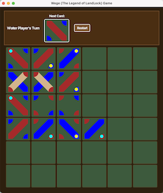

# Wege (The Legend of LandLock)
A fully functional two-player board game built with Java and JavaFX initially as a freshman final project for my CSDS 132 - Programming in Java at Case Western Reserve University. I have since continued building on it.

## About the Game
Wege is a tile-placing board game where two players — Land and Water — take turns placing cards on a grid. Players must match the land/water edges of adjacent cards. Special cards like bridges and cossacks add strategic depth, and gnomes can appear on cards to influence scoring.

## Features
- 6x6 game board (customizable via command line)
- Card deck with land, water, bridge, and cossack cards
- Gnome cards for both land and water paths
- Legal move validation — edges must match between adjacent cards
- Bridge card replacement mechanic
- Two-player turn-based system with status display
- Card rotation before placement
- Customizable board size and deck via command line arguments
- Restart button to reset the game without relaunching it
- Themed UI with an earthy green and brown color scheme

## Screenshots


## How to Run
To run, you must make sure you have Java and JavaFX installed, then compile and run: 

```bash
javac --module-path /path/to/javafx/lib --add-modules javafx.controls *.java
java --module-path /path/to/javafx/lib --add-modules javafx.controls Wege
```

### Command Line Options
| Command | Result |
|---|---|
| `java Wege` | Default 6x6 board |
| `java Wege 7 5` | 7x5 board |
| `java Wege 5` | 6x6 board with 5 of each specialty card |
| `java Wege 7 5 3` | 7x5 board with 3 of each specialty card |

## Technologies
- Java
- JavaFX
- JUnit 4

## Author
Mauro Nunez - Case Western Reserve University
